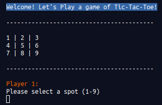

# Ruby Tic-Tac-Toe Game!

> A Tic-Tac-Toe Game Written for the Odin Project!

<div align='center'>
  
</div><br>

## Demo

[](https://repl.it/@andrewbaldwin44/@andrewbaldwin44/TicTacToe#main.rb)

## How to Play

Grab yourself a friend and chose who will be X's and who will be O's. Take turns placing your pieces. The first to connect three pieces in any direction wins!

## Dependecies

- Ruby 2.6.5 (or higher)

## Run the Project

__Clone the repo to your local machine using the terminal__:
```
$ git clone git@github.com:andrewbaldwin44/Ruby_Tic_Tac_Toe.git
```

1. Navigate into the project directory `cd Ruby_Tic_Tac_Toe`
2. Run the demo `ruby main.rb`

## Author

👤 **Andrew Baldwin**

- Github: [@andrewbaldwin44](https://github.com/andrewbaldwin44)
